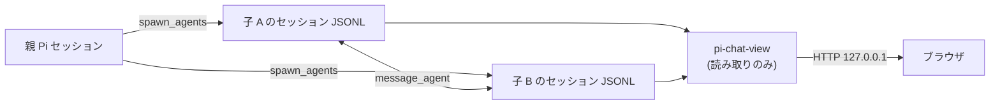

# pi-chat-view

pi-spawn の子エージェント同士の会話を、**1本の時系列**としてブラウザで読む Pi 拡張です。

子セッションの JSONL を読むだけで、書き込みも常駐も追加の記録も持ちません。
`/chat-view` でループバックに読み取り専用のサーバーを起動し、通知された URL をブラウザで開きます。



## 何が見えるか

同じ `spawn_agents` で起動した子同士（兄弟）のやり取りを、時刻順に1本へ並べます。
`resume_run_id` でラウンドを進めても子は同じファイルへ追記するため、会話は同じスレッドとして続きます。

| 表示 | 元になる記録 | 既定 |
|---|---|---|
| 発言 | `message_agent` の呼び出し | 表示 |
| 描写・回答 | assistant の text ブロック | 表示 |
| 指示 | 配送の複製を除いた user メッセージ | 折りたたみ |
| reasoning | thinking / reasoning ブロック | 非表示（トグル） |
| ツール呼び出し | `message_agent` 以外の toolCall | 非表示（トグル） |

- 指示には、最初のタスク文と、再開時のタスク文の両方が含まれます
- 指示の先頭にある兄弟一覧（sibling ブリーフィング）は表示しません
- ツール呼び出しは名前と引数の短い digest として表示します
- 不明な種類のエントリは無視します

配送されたメッセージは受け手の user メッセージにも残ります。
同じスレッド内に送信側の `message_agent` 呼び出しがあり、本文が一致する場合に限り、受け手側の複製を除外します。
送信側の記録がない場合は、受け手側のメッセージを指示として表示します。

```
┌ スレッド一覧 ────┬── タイムライン ──────────────────────────┐
│ 13:00 – 13:17 ●  │  ねむ (nemu)      13:00:02            │
│ nemu · sakura    │  ┌────────────────────────────────┐   │
│ 12:11 – 12:17    │  │ これ、本物……？                    │   │
│ nemu · sakura    │  └────────────────────────────────┘   │
│                  │  窓の外の桜が、まだ昼の光を受けている。 │
│                  │  ▸ 指示 · 13:00                        │
└──────────────────┴────────────────────────────────────────┘
```

- 発言は相手ごとに色分けし、時刻・差出人・宛先を1行にまとめます
- 2分を超えてあいた箇所には「— 3分後 —」のような区切りを入れます
- スレッド一覧には開始時刻と最終更新時刻を表示し、最終更新から90秒以内のスレッドには ● を付けます

## 前提条件

| 項目 | 条件 |
|---|---|
| Pi | 0.87.1（2026-09-28 に確認） |
| Node.js | 22.19.0 以上 |
| 子セッション | pi-spawn が `<agentDir>/spawn-sessions/` に JSONL を書いていること |
| 実行時の pi-spawn | 不要（子セッション JSONL の配置と形式には依存します） |

`agentDir` の既定値は `~/.pi/agent` で、`PI_CODING_AGENT_DIR` で変更できます。

## インストール

```bash
pi install git:github.com/kurowashi/pi-chat-view
```

ref を固定する場合は `pi install git:github.com/kurowashi/pi-chat-view@<tag|commit>`。

ローカルの作業コピーを使う場合は、`settings.json` の `packages` に相対パスで追加します。
`pi --extension /path/to/pi-chat-view/src/index.ts` で直接読み込むこともできます。

## 使い方

| コマンド | 動作 |
|---|---|
| `/chat-view` | サーバーを起動し、URL を通知します |
| `/chat-view start` | `/chat-view` と同じ |
| `/chat-view stop` | サーバーを停止します |

起動済みのときに `/chat-view` を実行すると、URL を再表示します。
起動中に実行した場合は、起動中であることを通知します。

表示された URL（既定 `http://127.0.0.1:7787`）をブラウザで開きます。

- 追記は1.5秒ごとに反映します
- スレッド一覧は7.5秒ごとに確認します
- タブが非表示の間はどちらも停止します
- `reasoning` / `tools` のトグル状態は URL に残るため、リンクとして共有できます
- 開いているスレッドは URL の `#` で表します（例 `#47aac6be+f83c6332`）
- Pi の終了時にサーバーは自動で閉じます

## スレッドの決まり方

| 規則 | 内容 |
|---|---|
| 参加者 | 同じ spawn 呼び出しの子 |
| 手がかり | 子のタスク先頭にある兄弟一覧の参照 |
| 継続 | resume は同じファイルへの追記なので同じスレッド |
| 識別子 | 子セッション id を昇順に `+` で連結した文字列 |
| 兄弟のいない子 | 1ファイルだけのスレッド |

- 兄弟一覧の参照先がスキャン対象のファイルにある場合だけを辺とします
- 兄弟一覧は `name (id)`、`target_run_id= / name= / agent=`、`target_session_id= / name= / agent=` の3形式を読みます
- 同定に使うのはファイル名のセッション id と兄弟一覧だけです。ビューアは親セッションを読まないため、pi-spawn が返す session id / entry id は使いません
- 過去の位置から再開した子（`resume_entry_id`）は、最後の entry から `parentId` をたどった分岐だけを表示します
- 兄弟一覧を解釈できない場合は、一覧とタイムラインに警告を表示します（pi-spawn の形式変更の検知）
- 一覧は最終更新が新しい順で、既定 100 件です。`?limit=` で最大 1000 件まで増やせます

## 設定

`~/.pi/agent/chat-view.json`（`PI_CODING_AGENT_DIR` で変更可）

```json
{
	"port": 7787
}
```

| キー | 既定 | 意味 |
|---|---|---|
| `port` | 7787 | 待ち受けポート（1〜65535 の整数） |

- ファイルがない場合は既定値で動作します
- 値が不正な場合は既定値で動作し、警告を通知します
- 待ち受けアドレスは `127.0.0.1` 固定です
- ポートが使用中の場合は起動せず、その旨を通知します

## 制約と回避策

これらはすべて意図的な制約です。

| 制約 | 回避策 |
|---|---|
| ループバックのみで待ち受ける | SSH ポート転送などを使う |
| 読み取り専用（GET 以外は 405） | 元のセッションは `pi --session <path>` で開く |
| 表示は子セッションだけ | ラウンドごとの指示も子のファイルにある |
| 実行中と完了の区別がない | 最終更新時刻と ● で判断する |
| run id からスレッドを引けない | 一覧から選ぶ |
| ブラウザを自動で開かない | 通知された URL を開く |
| 認証がない | ループバック限定と読み取り専用に依存する |
| 更新に最大1.5秒かかる | `pi --session` を使う |

追加の条件は次のとおりです。

- `inheritConversation` を使った子では、親から継承した履歴を表示しません。ただし親セッションのファイルが残っている場合に限ります
- 親セッションのファイルが無い場合、その子は継承した履歴を含めて表示します
- 兄弟一覧が無い子は単独スレッドになります
- 分岐が読み取れない古い形式のファイルは、書かれた順にすべて表示します
- 1回の表示で読み込むファイル数と、開いているタブ数に比例して I/O が増えます

## 開発者向け情報

この節は pi-chat-view 自体を開発する人向けです。
実行時依存はなく、依存は devDependency と、Pi が供給する peer 依存だけです。

```bash
npm install
npm run verify
npm test
npm run test:coverage
npm run fix
```

- `npm run verify`: 完了条件を検証します（biome + tsc + 全テスト + カバレッジ閾値）
- `npm test`: 全テストを実行します
- `npm run test:coverage`: unit と integration だけをカバレッジ閾値付きで実行します
- `npm run fix`: 自動修正を実行します

コミット前に lefthook が format/lint/型検査を実行します。
CI はフックと同じ検査を独立に実行します（フックは利便性のためのもので、ゲートの権威ではありません）。

フックの有効化は `npx lefthook install` を手動で実行します。
`package.json` の lifecycle script（`prepare` / `postinstall`）には置きません。
`pi install git:...` は `npm install --omit=dev` を実行するため、devDependency の lefthook が無い状態で script が走るとインストールごと失敗するからです。
