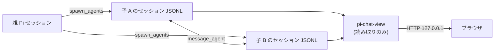

# pi-chat-view

pi-spawn の子エージェント同士の会話を、**1本の時系列**としてブラウザで読む Pi 拡張です。

子セッションの JSONL を読むだけで、書き込みも常駐も追加の記録も持ちません。
`/chat-view` でループバックに読み取り専用のサーバーを起動し、表示された URL を開きます。



## 何が見えるか

同じ `spawn_agents` で起動した子同士（兄弟）のやり取りを、時刻順に1本へ並べます。
`resume_run_id` でラウンドを進めても子は同じファイルへ追記するため、会話は同じスレッドとして続きます。

| 表示 | 元になる記録 | 既定 |
|---|---|---|
| 発言 | `message_agent` の呼び出し | 表示 |
| 描写・回答 | assistant の text ブロック | 表示 |
| 指示 | 最初と再開時の user メッセージ（兄弟一覧を除いたタスク文） | 折りたたみ |
| reasoning | thinking ブロック | 非表示（トグル） |
| ツール呼び出し | `message_agent` 以外の toolCall | 非表示（トグル） |

配送されたメッセージは受け手の user メッセージにも現れますが、送信側の発言と同じ内容のため二重には表示しません。

```
┌ スレッド一覧 ────┬── タイムライン ──────────────────────────┐
│ 13:00 – 13:17 ●  │  ねむ (nemu)      13:00:02            │
│ nemu · sakura    │  ┌────────────────────────────────┐   │
│ 12:11 – 12:17    │  │ これ、本物……？                    │   │
│ nemu · sakura    │  └────────────────────────────────┘   │
│                  │  窓の外の桜が、まだ昼の光を受けている。 │
│                  │  ▸ 指示 · 13:00                        │
└──────────────────┴────────────────────────────────────────┘
```

- 発言は相手ごとに色分けし、時刻・差出人・宛先を1行にまとめます
- 2分以上あいた箇所には「— 3分後 —」のような区切りを入れます
- スレッド一覧の時刻は最終更新です（90秒以内の更新には ● が付きます）

## 前提条件

| 項目 | 条件 |
|---|---|
| Pi | インストール済みであること。0.87.1 で検証（他のバージョンは未検証） |
| Node.js | 22.19.0 以上 |
| pi-spawn | 子セッションを `~/.pi/agent/spawn-sessions/` に書くこと（pi-spawn 本体との連携は不要） |

## インストール

```bash
pi install git:github.com/kurowashi/pi-chat-view
```

ref を固定する場合は `pi install git:github.com/kurowashi/pi-chat-view@<tag|commit>`。

ローカルの作業コピーを使う場合は、`settings.json` の `packages` に相対パスで追加するか、
`pi --extension /path/to/pi-chat-view/src/index.ts` で直接読み込みます。

## 使い方

| コマンド | 動作 |
|---|---|
| `/chat-view` | サーバーを起動し、URL を通知します（起動済みなら URL を再表示） |
| `/chat-view start` | `/chat-view` と同じ |
| `/chat-view stop` | サーバーを停止します |

表示された URL（既定 `http://127.0.0.1:7787`）をブラウザで開きます。

- 追記は1.5秒ごとに反映します（タブが非表示の間は止まります）
- `reasoning` / `tools` のトグル状態は URL に残るため、リンクとして共有できます
- 開いているスレッドは URL の `#` で表します（例 `#47aac6be+f83c6332`）
- Pi の終了時にサーバーは自動で閉じます

## スレッドの決まり方

| 規則 | 内容 |
|---|---|
| 参加者 | 同じ spawn 呼び出しの子。子のタスク先頭にある兄弟一覧（sibling ブリーフィング）の参照で繋がります |
| 継続 | resume は同じファイルへ追記するため、複数ラウンドが1スレッドになります |
| 識別子 | 所属する子セッションの id を昇順に `+` で連結したもの（例 `47aac6be+f83c6332`） |
| 一覧の順序 | 最終更新が新しい順。既定で100件、`?limit=` で最大1000件 |
| 兄弟のいない子 | 1ファイルだけのスレッドとして表示します |

run id では検索しません。resume 後の run id はファイル名のセッション id と一致しないため、
run id を手がかりにすると会話を取り違えるからです。

## 設定

`~/.pi/agent/chat-view.json`（`PI_CODING_AGENT_DIR` で変更可）

```json
{
	"port": 7787
}
```

| キー | 既定 | 意味 |
|---|---|---|
| `port` | 7787 | 待ち受けポート |

- ファイルがない場合と値が不正な場合は既定値で動作し、不正な場合だけ警告を通知します
- 待ち受けアドレスは `127.0.0.1` 固定です（ネットワークへ公開しません）
- ポートが使用中の場合は起動せず、その旨を通知します

## 制約と回避策

これらはすべて意図的な制約です。

| 制約 | 回避策 |
|---|---|
| ループバックのみで待ち受ける | 別端末から見たい場合は SSH ポート転送などを使う |
| 読み取り専用（書き込み・削除・圧縮をしない） | 元のセッションは `pi --session <path>` で開く |
| 表示するのは子セッションだけ | どのラウンドの指示も子のファイルに入っているため文脈は追える |
| 実行中と完了の区別を持たない | 一覧の最終更新時刻と ● で判断する |
| run id からスレッドを引けない | 一覧から選ぶ |
| ブラウザを自動で開かない | 通知された URL を開く |
| 会話の同定は兄弟一覧に依存する | `inheritConversation` の子など兄弟一覧がない場合は単独スレッドになる |
| 認証がない | ループバック限定のうえ、読み取り専用であることに依存する |

## 開発者向け情報

この節は pi-chat-view 自体を開発する人向けです。実行時依存はなく、依存は devDependency と、
Pi が供給する peer 依存だけです。コマンドはリポジトリのルートで実行します。

```bash
npm install
npm run verify
npm test
npm run test:coverage
npm run fix
```

- `npm run verify`: 完了条件を検証します（biome + tsc + 全テスト + カバレッジ閾値）
- `npm test`: 全テストを実行します
- `npm run test:coverage`: unit と integration だけをカバレッジ閾値付きで実行します
- `npm run fix`: 自動修正を実行します

コミット前に lefthook が format/lint/型検査を実行します。CI はフックと同じ検査を独立に実行します
（フックは利便性のためのもので、ゲートの権威ではありません）。

フックの有効化は `npx lefthook install` を手動で実行します。`package.json` の lifecycle script
（`prepare` / `postinstall`）には置きません: `pi install git:...` は `npm install --omit=dev` を
実行するため、devDependency の lefthook が無い状態で script が走るとインストールごと失敗します。
